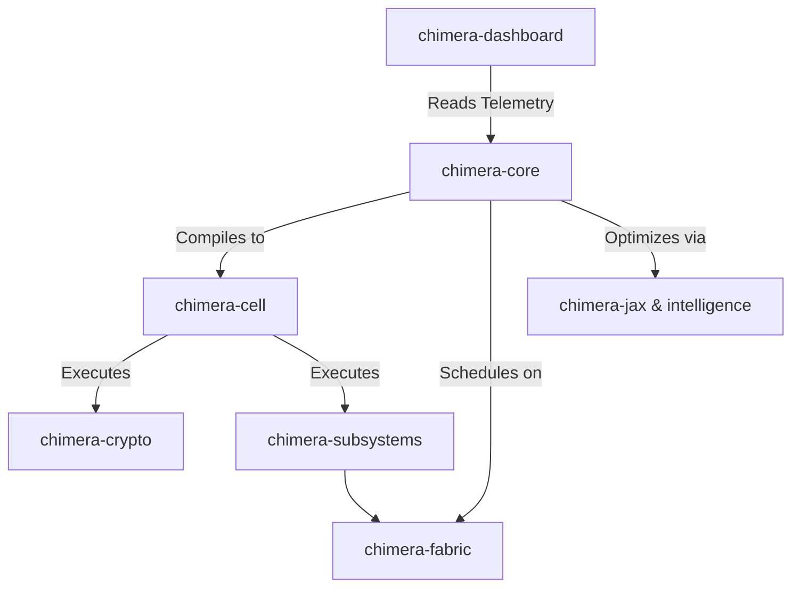

# ChimeraOS:

Technical Implementation & Roadmap

## Development Roadmap

| Module | Components | Timeline | Dependencies |
| :--- | :--- | :--- | :--- |
| **chimera-core** | Primitives, Error handling, Basic traits | Week 1-2 | None |
| **chimera-fabric** | Hardware detection, Memory abstraction | Week 3-4 | core |
| **chimera-crypto** | SHA-256, Basic hash implementations | Week 5-8 | core, fabric |
| **chimera-cell** | WASM sandbox, Module system | Week 9-12 | core |

### Milestones
- **Phase 1**: `cargo run --example simple-miner` works on CPU.
- **Phase 2 (Intelligence)**: Differentiable hash approximation via `chimera-jax` and `chimera-intelligence`.
- **Phase 3 (Subsystems)**: Validation of Grover (Quantum), EchoVoid (Math), VPI (Physics), SST (FPGA), and Sonar (Signal Processing).
- **Phase 4 (Integration)**: Assembly of the orchestrator, plugin registry, and CLI.
- **Phase 5 (Optimization)**: Performance tuning (Target: <100ns latency, 10M hashes/sec/core).

## Workspace Configuration

### Cargo.toml
```toml
[package]
name = "chimera-core"
version = "0.1.0"
edition = "2021"

[dependencies]
tokio = { version = "1.35", features = ["full"] }
async-trait = "0.1"
serde = { version = "1.0", features = ["derive"] }
serde_json = "1.0"
thiserror = "1.0"
wasmtime = "14.0"
vergen = { version = "8.2", features = ["build", "cargo", "git", "rustc"] }
```

## Core Implementation

### Primitives (chimera-core/src/primitives.rs)
Defines the fundamental types (Hash, Nonce, NodeId) and operational metrics (OpCost, ThermalState).

```rust
use serde::{Serialize, Deserialize};
use std::sync::atomic::{AtomicU64, Ordering};

#[derive(Debug, Clone, Copy, PartialEq, Eq, Hash, Serialize, Deserialize)]
pub struct Hash(pub [u8; 32]);

#[derive(Debug, Clone, Copy, PartialEq, Eq, PartialOrd, Ord, Hash, Serialize, Deserialize)]
pub struct Nonce(pub u64);

#[derive(Debug, Clone, Copy, Default, Serialize, Deserialize)]
pub struct OpCost {
    pub joules: f64,
    pub seconds: f64,
    pub dollars: f64,
}
```

### JAX-Style Transforms (chimera-core/src/transforms.rs)
Implements gradient-based optimization for mining algorithms.

```rust
pub trait Transform<Input> {
    type Output;
    fn apply(&self, input: Input) -> Self::Output;
    fn name(&self) -> &'static str;
}

pub struct Grad<Input, Output> {
    f: BoxedFunction<Input, Output>,
    argnums: Vec<usize>,
}
```

### The Alchemist Engine (chimera-core/src/alchemist.rs)
Translates natural language intent into mining strategies.

```rust
pub struct Alchemist {
    config: AlchemistConfig,
    llm: Box<dyn LanguageModel + Send + Sync>,
    cell_registry: Arc<CellRegistry>,
    fabric_manager: Arc<FabricManager>,
}

impl Alchemist {
    pub async fn remix(&self, intent: &str) -> Result<MiningStrategy, AlchemistError> {
        let spec = self.parse_intent(intent).await?;
        let strategy = self.generate_strategy(spec).await?;
        Ok(strategy)
    }
}
```

## Operations Dashboard (Streamlit)

### Dashboard UI (chimera-dashboard/app.py)
```python
import streamlit as st
import plotly.graph_objects as go

st.title("⚡ ChimeraOS Dashboard")

if st.session_state.connected:
    stats = st.session_state.client.get_global_stats()
    cols = st.columns(5)
    cols[0].metric("Total Hashrate", f"{stats['hashrate'] / 1e12:.2f} TH/s")
    cols[1].metric("Power Draw", f"{stats['power']:.1f} kW")
```

### 3D Visualization
Uses Plotly to render a 3D scatter plot of device health and hashrate height across the fleet physical topology.

---

## AI Generated: ARCHITECTURE

# ChimeraOS Repository Architecture

## System Overview
ChimeraOS is an advanced, hardware-accelerated, and AI-driven orchestration system for cryptographic mining and compute tasks. It features a Rust-based high-performance core natively executing WASM sandboxes, coupled with machine learning optimization (JAX-style transforms), and an LLM-driven orchestration engine ("Alchemist"). A Python-based Streamlit operations dashboard provides fleet visualization and real-time telemetry.

---

## Directory Structure

```text
chimera-os/
├── Cargo.toml                          # Rust workspace configuration
├── README.md                           # Repository documentation and roadmap
├── chimera-core/                       # Foundational primitives and LLM engine
│   ├── Cargo.toml
│   └── src/
│       ├── lib.rs
│       ├── primitives.rs               # Defines Hash, Nonce, OpCost, ThermalState
│       ├── transforms.rs               # JAX-style differentiable transforms
│       └── alchemist.rs                # LLM-driven natural language strategy engine
├── chimera-fabric/                     # Hardware and memory abstraction layer
│   ├── Cargo.toml
│   └── src/
│       ├── lib.rs
│       ├── topology.rs                 # Physical device topology mapping
│       └── memory.rs                   # Hardware-level memory abstraction
├── chimera-crypto/                     # Cryptographic hash implementations
│   ├── Cargo.toml
│   └── src/
│       ├── lib.rs
│       └── sha256.rs                   # Optimized SHA-256 implementation
├── chimera-cell/                       # WASM execution sandbox
│   ├── Cargo.toml
│   └── src/
│       ├── lib.rs
│       └── sandbox.rs                  # Wasmtime module system initialization
├── chimera-intelligence/               # AI/ML optimization and inference layer
│   ├── Cargo.toml
│   └── src/lib.rs
├── chimera-jax/                        # Differentiable hash approximation layer
│   ├── Cargo.toml
│   └── src/lib.rs
├── chimera-subsystems/                 # Specialized domain subsystems (Phase 3)
│   ├── Cargo.toml
│   └── src/
│       ├── grover.rs                   # Quantum algorithm validation
│       ├── echovoid.rs                 # Advanced mathematics validation
│       ├── vpi.rs                      # Physics validations
│       ├── sst.rs                      # FPGA interactions
│       └── sonar.rs                    # Signal processing module
├── chimera-dashboard/                  # Telemetry and operations UI
│   ├── requirements.txt                # Python dependencies (streamlit, plotly)
│   └── app.py                          # Streamlit dashboard and 3D visualization
└── examples/                           # Integration examples and entrypoints
    └── simple-miner.rs                 # Phase 1 CPU miner validation
```

---

## Component Deep-Dive & Key Files

### 1. `chimera-core` (The Heart)
*   **Purpose**: Provides standard data structures, operational metrics, and intelligent orchestration.
*   **Key Files**:
    *   `src/primitives.rs`: Contains core domain models (`Hash`, `Nonce`, `OpCost`). Used globally across all crates to ensure type safety.
    *   `src/transforms.rs`: Exposes `Transform` traits and `Grad` structures to allow ML-driven gradient descent on cryptographic structures.
    *   `src/alchemist.rs`: Implements the `Alchemist` engine. It connects to an LLM to parse natural language intent, interfacing with `CellRegistry` and `FabricManager` to auto-generate executing mining strategies.

### 2. `chimera-fabric` (The Skeleton)
*   **Purpose**: Abstracts underlying hardware topology, memory mapping, and device states (CPU, GPU, FPGA).
*   **Key Files**:
    *   `src/topology.rs`: Maps node architecture, supporting the <100ns latency constraint by optimizing data locality.

### 3. `chimera-cell` (The Sandbox)
*   **Purpose**: Secure runtime environment for modular algorithms.
*   **Key Files**:
    *   `src/sandbox.rs`: Wraps `wasmtime` to safely load and execute dynamic mining strategies generated by the Alchemist or subsystem plugins.

### 4. `chimera-crypto` & Subsystems (The Muscle)
*   **Purpose**: Executes mathematical workloads. `crypto` handles traditional hashes, while `chimera-subsystems` handles exotic execution pathways (Grover/Quantum, Sonar/Signal).
*   **Key Files**:
    *   `src/sha256.rs`: Base hashing algorithm.
    *   `src/grover.rs` & `src/sst.rs`: Plugin integration points for Quantum validation and FPGA bridging.

### 5. `chimera-dashboard` (The Control Center)
*   **Purpose**: Visualizes fleet health, power draw, and hash rates.
*   **Key Files**:
    *   `app.py`: Streamlit application parsing JSON-RPC/WebSocket telemetry from `chimera-core`. Renders Plotly 3D scatter topologies showing device health on the Z-axis.

---

## Overall System Design

### Architecture Workflow
1.  **Intent Parsing**: An operator inputs a natural language command (e.g., *"Maximize SHA-256 efficiency prioritizing power draw"*). The `Alchemist` (`chimera-core/src/alchemist.rs`) queries an LLM to deduce a `MiningStrategy`.
2.  **Resource Allocation**: The Alchemist consults `chimera-fabric` to assess available hardware (CPU, FPGA via SST, etc.) and allocates memory optimally.
3.  **Optimization**: The strategy is passed through `chimera-jax` and `chimera-intelligence` to apply differentiable transformations (`chimera-core/src/transforms.rs`) that approximate optimal hash gradients.
4.  **Execution**: The optimized mathematical sequence is compiled and injected into a WASM sandbox (`chimera-cell`). Target execution throughput is strictly bound to <100ns latency and 10M hashes/sec/core.
5.  **Telemetry**: Execution metrics (`OpCost`, Hashes) are passed asynchronously via `tokio` channels back to the orchestrator, which streams them to the `chimera-dashboard` for 3D UI rendering.

### Dependency Flow

**2026 (c) Synth-fuse Labs  -  José Roberto Jiménez Cordero   - tijuanapaint@gmail.com**  -  @hipotermiah
